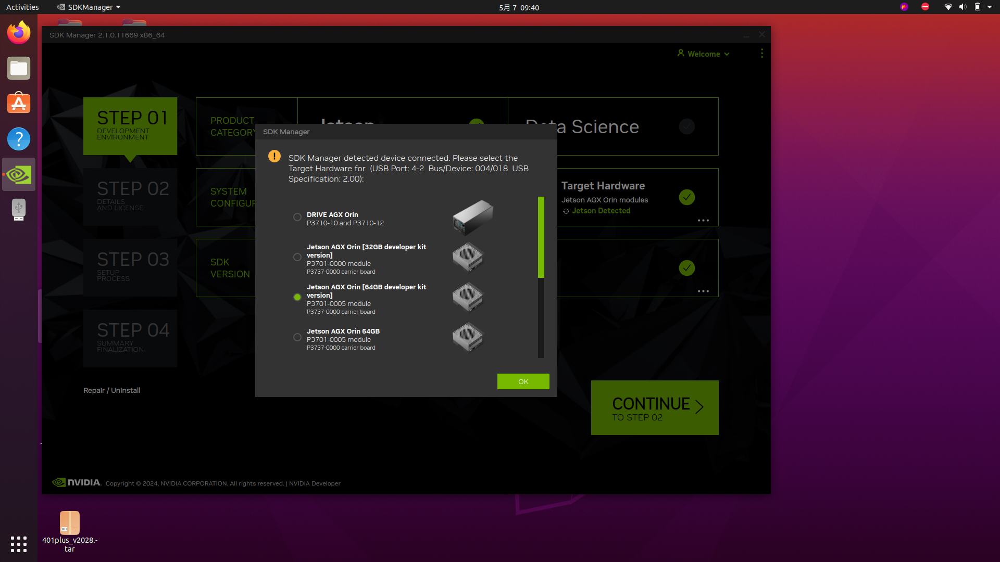
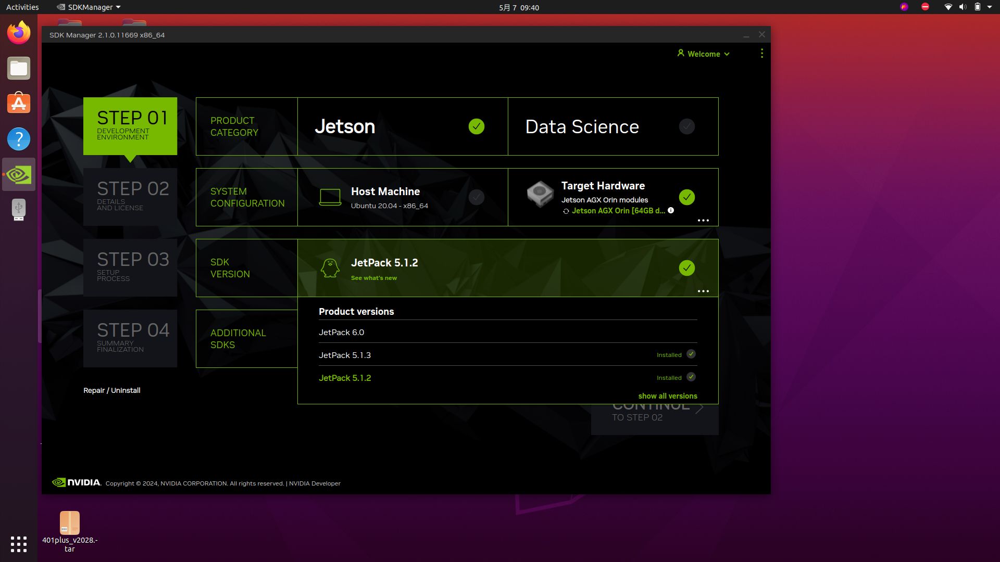
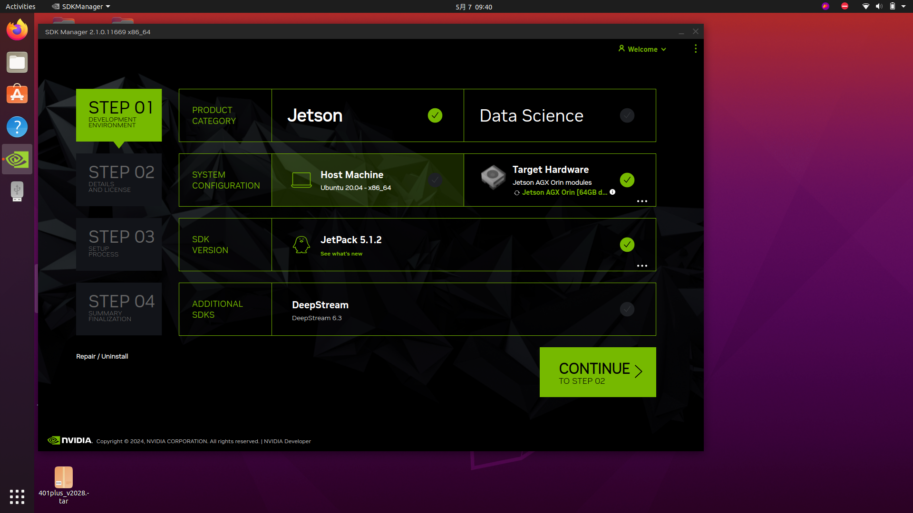
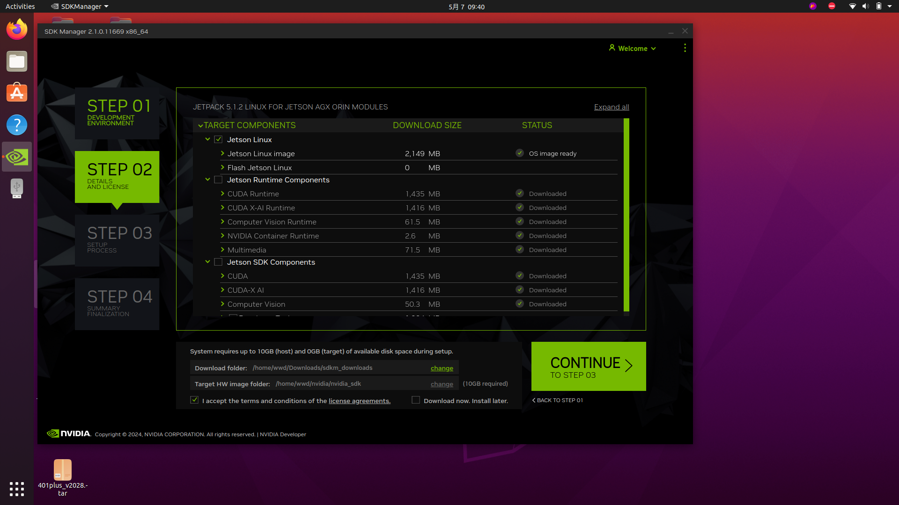
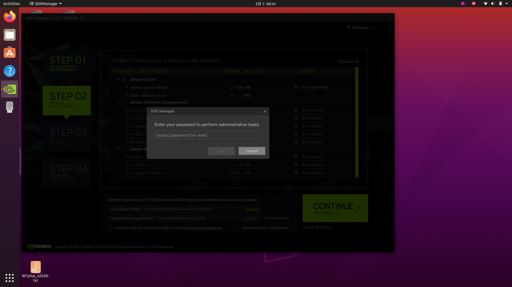
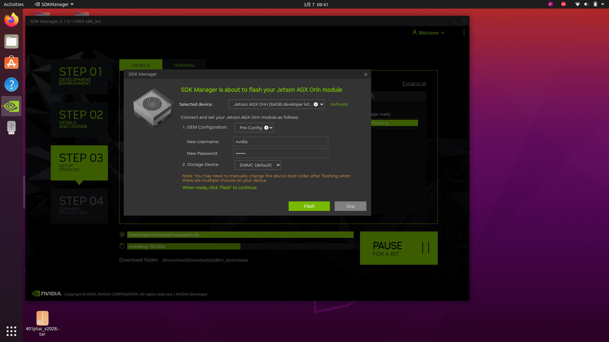
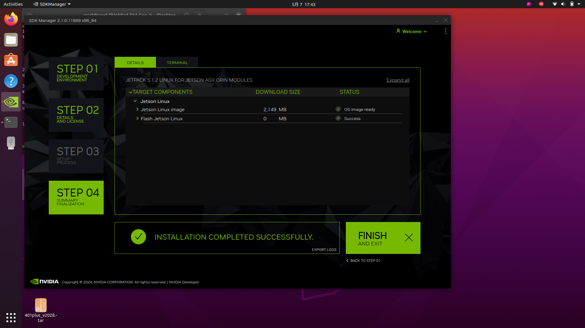

# 刷机教程

### 1，打开刷机电脑上的SDK Manager 软件

### 2，给Orin通电，刷机线连接右侧有两个USB接口那一侧的typec接口

### 3，按住Orin上三个按键的中间按键，短按一下右侧按键后松开，查看刷机软件

### 4，选择弹窗的Jetson AGX Orin [64GB developer kit version]，选择OK，如图：

### 5，PRODUCT CATEGORY 选择Jetson，SYSTEM CONFIGURATION 不勾选Host ...，选择完成后，点击CONTINUE 如下图：

### 6，进入第三步，只选择Jetson Linux，勾选I accept the terms and conditions of the license agreements. 点击CONTINUE输入电脑密码如下图：

### 7，在弹窗里按图示填入用户名密码后，点击Flash，等待刷机完成，Username：nvidia Password：nvidia

### 8，完成后出现 INSTALLATION COMPLETED SUCCESSFULLY 代表成功

