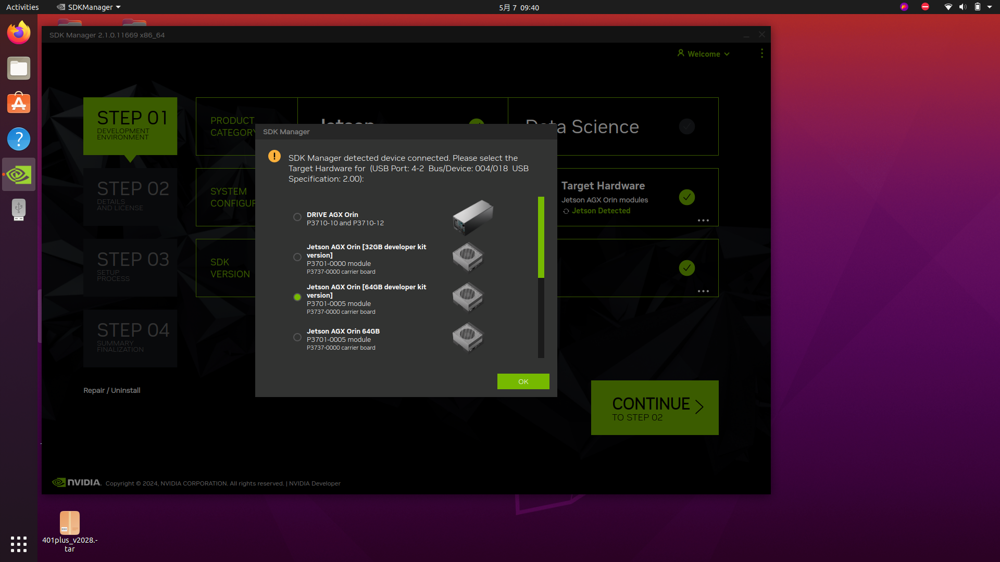
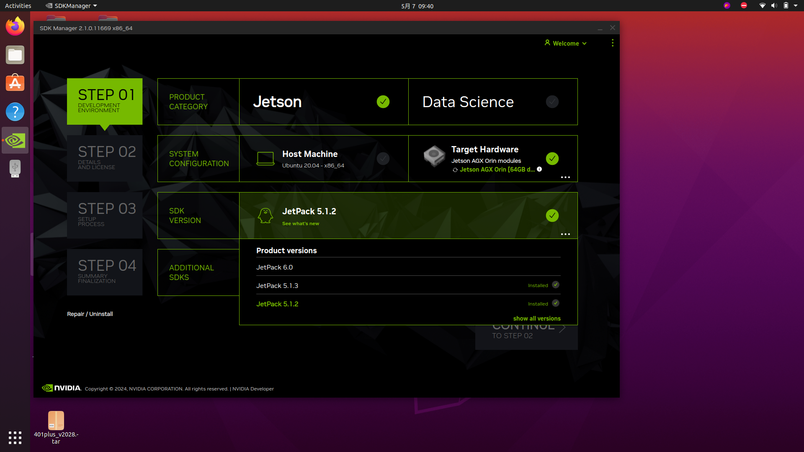
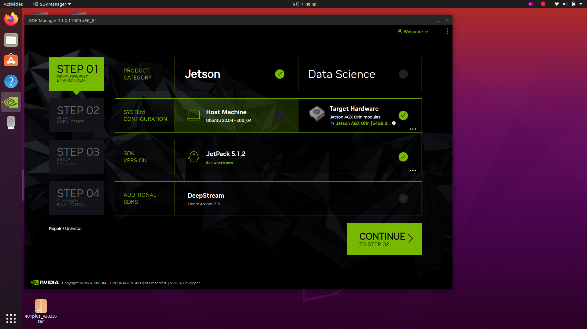
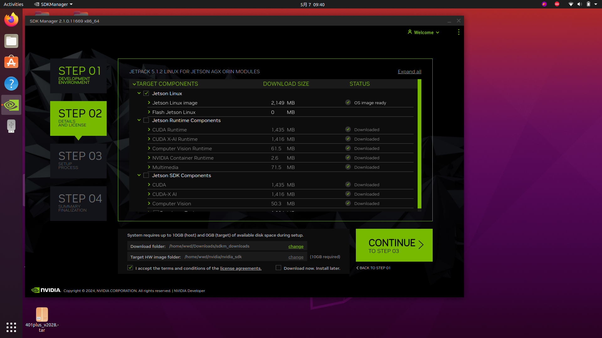
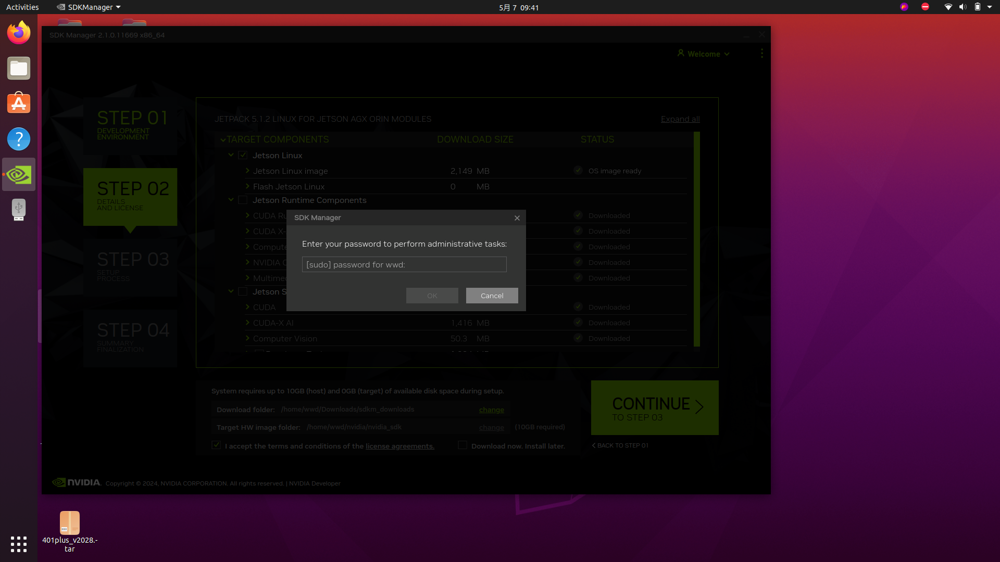
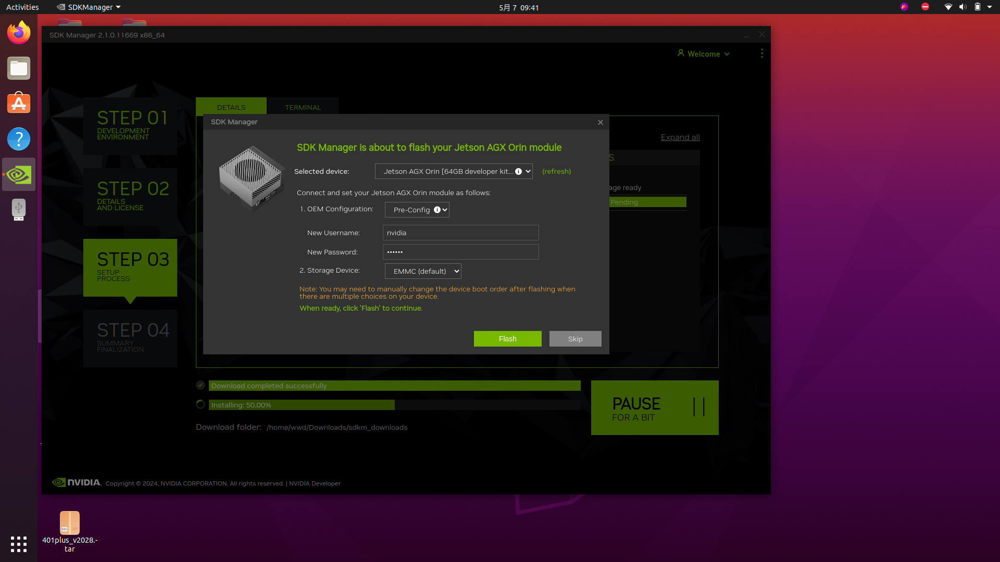
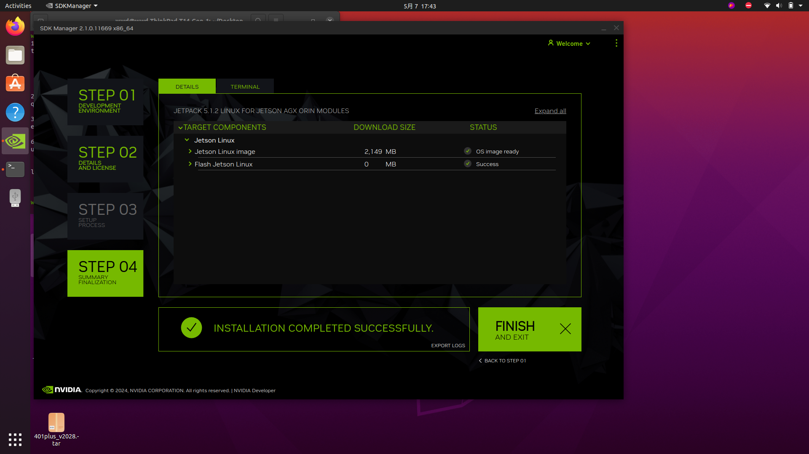

# Flashing Guide

## JetPack Version Note

For JetPack 5.1.2 systems, select JetPack 5.1.2 / Jetson Linux 35.4.1 in SDK Manager.

Some newer SDK Manager releases may no longer show JetPack 5.1.2 in the version list. If JetPack 5.1.2 is missing, use an older SDK Manager release that still lists JetPack 5.1.2, or use an offline/manual NVIDIA package that matches Jetson Linux 35.4.1. Do not select JetPack 6.x when the target setup depends on the legacy `nova-carter-init` package.

### 1. Open SDK Manager on the flashing host.

### 2. Power on the Orin and connect the flashing cable to the Type-C port on the side with two USB ports.

### 3. Hold the middle button on the Orin, briefly press the right button, then release and check SDK Manager.

### 4. Select `Jetson AGX Orin [64GB developer kit version]` in the popup, then select OK.



### 5. Set PRODUCT CATEGORY to `Jetson`, leave the Host option unchecked under SYSTEM CONFIGURATION, then click CONTINUE.





### 6. In step 3, select only Jetson Linux, check `I accept the terms and conditions of the license agreements`, then click CONTINUE and enter the host password.





### 7. Fill in the username and password in the popup, then click Flash and wait for flashing to finish.

Recommended defaults:

```text
Username: nvidia
Password: nvidia
```



### 8. `INSTALLATION COMPLETED SUCCESSFULLY` means flashing succeeded.


